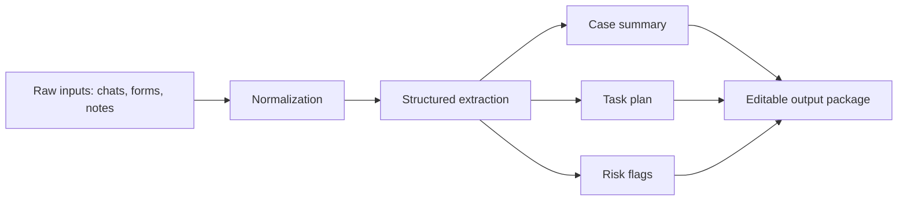

# ClinicFlow AI

ClinicFlow AI is a lightweight workflow assistant prototype for small clinics, solo practices, and service teams. It turns messy intake materials into structured outputs such as case summaries, action items, risk flags, and draft follow-up notes.

This repository is intentionally small. It exists to demonstrate a real project direction for API-driven development and prompt workflow testing with MiMo and other frontier models.

## What problem it solves

Small teams often work from fragmented materials:

- chat logs
- intake forms
- screenshot notes
- voice transcription text
- ad hoc follow-up requests

Those inputs are hard to convert into a clean operational workflow. ClinicFlow AI aims to normalize them into structured records and next actions.

## Core workflow

1. Collect raw intake material.
2. Extract structured fields from mixed text.
3. Generate a summary, action list, and risk checklist.
4. Support iterative refinement as the user adds more materials.



## Repository layout

- `src/clinicflow/pipeline.py`: minimal extraction and drafting pipeline
- `src/clinicflow/schemas.py`: typed data structures
- `src/clinicflow/mimo_client.py`: MiMo API client stub for later integration
- `examples/sample_case.txt`: example messy intake text
- `docs/project-brief.md`: application-ready project description
- `docs/reference-notes.md`: related references and implementation notes

## Quick start

Use Python 3.10+.

```bash
python -m src.clinicflow.pipeline examples/sample_case.txt
```

The current version uses deterministic local rules to simulate the output shape. The next step is replacing the drafting layer with MiMo API calls for long-context extraction and structured generation.

## Why MiMo

This project needs:

- long-context handling for multi-message intake threads
- stable structured extraction
- iterative task planning
- future multimodal support for screenshots and image-based forms
- frequent prompt and workflow regression testing

## Roadmap

- V0: local prototype and schema design
- V1: MiMo-backed extraction and summary generation
- V2: prompt templates for different clinic and service workflows
- V3: multimodal intake support
- V4: internal evaluation dataset and regression harness
